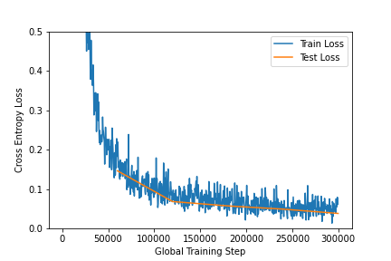
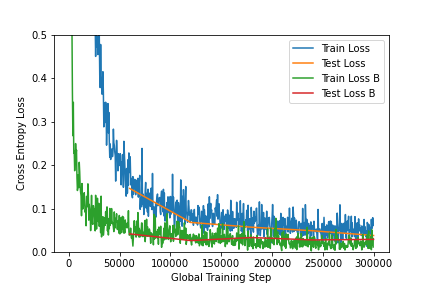
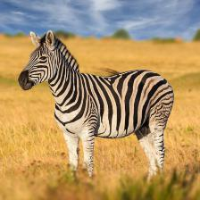
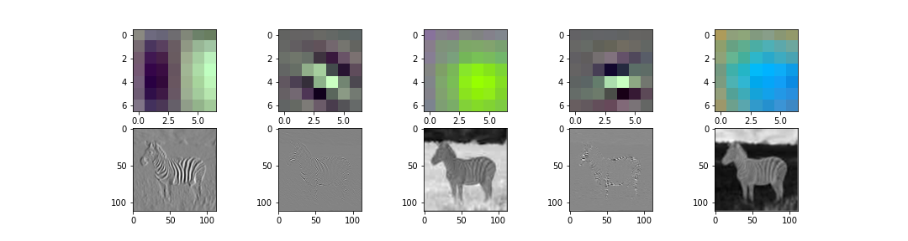
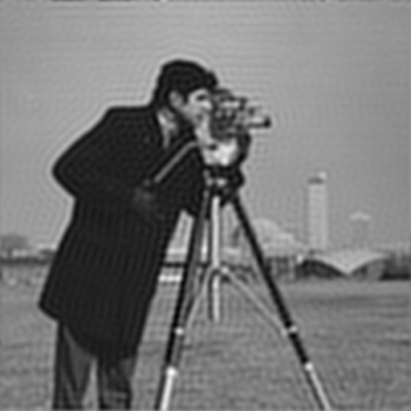
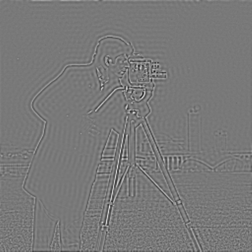
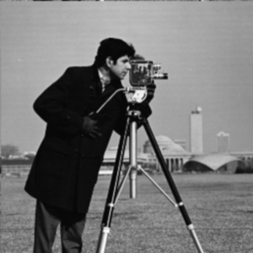
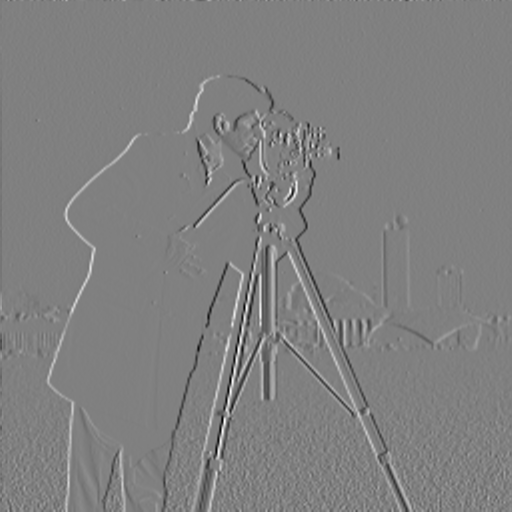
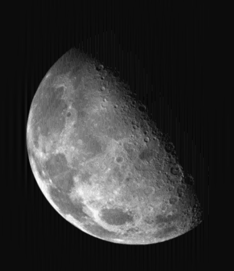
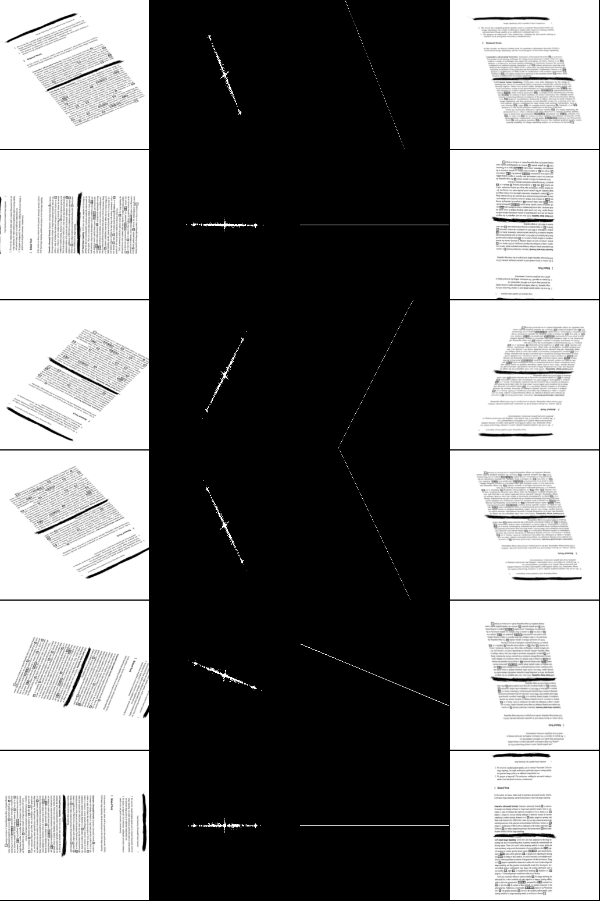

# Assignment 2 image processing

Erik Myhre, Nicolai Molstad

## Task 1

$outputImageDimension = (inputImageDimension - filterDimension + 2 * padding)/stride + 1$ (1)

a) 

We want all outputimages to be the same size as the inputimage. To make this happen have to have a padding of 2, this is because of our $5x5$ kernel, as we need a 2 padding around for the center of the filter to reach each corner of the image

b) 

We start to get filterDimension alone

$(outputImageDimension + 1)*stride = inputImageDimension - filterDimension + 2 * padding$

=>

$(outputImageDimension + 1)*stride  - inputImageDimension - 2 * padding = - filterDimension$

=>
$filterDimenson = -((outputImageDimension + 1)*stride  - inputImageDimension - 2 * padding)$

=>

$filterDimension = -((504-1)*1 - 512 - 2*0)$

=>

$filterDimension = -(503 - 512) = 9$

The filterDimension is $9x9$

c) 

If we perform subsampling with the size of $2x2$ kernel with a stride of 2 on a $504x504$ image, we will half the image's height and width, because each $2x2$ pixel-block will be reduced to a single pixel. Therefore, the output image is 
$252x252$ after the pooling layer.

d) 

We use the formula given in the assignment (1),

$outputImageDimension = (252 - 3 + 2 * 0)/1 + 1 =  250$

The dimmension is $250x250$

e) 

Each filter has $filterDimension^2∗channels$ number of weights. So, a $5x5$ filter with 3 channels, will have $5^23=75$ number of weights. Since we can have more than one filter, we multiply the result with the number of filters. So, 32 filters result in $7532=2400$ weights.
The number of biases is the same as the number of filters. So, we have a total of $2400+32=2432$ paremeters.

We use the formula $kernel\ dimensioninput\ channelsnumber\ of\ filters+number\ of\ filters\ (i.e.\ bias)$ to calculate the number of parameters in each convolutional layer.

Convolution layer 1:

* Input 32x32 with 3 channels (RGB)
* Kernel = 5x5, stride = 1, padding = 2
* Filter dimension = 5x5x3
* Number of filters = 32
* Number of parameters = $5^2332+32=2432$
* Output dimension: 32x32 (unchanged)

Pooling layer 1:

* Input 32x32
* Max pooling with kernel size = 2x2, stride = 2
* Output 16x16

Convolution layer 2:

* Input 16x16 with 32 channels
* Kernel = 3x3, stride = 1, padding = 1
* Number of filters = 64
* Filter dimension = 3x3x32
* Number of parameters = $3^23264+64=18496$
* Output dimension: 16x16 (unchanged)

Pooling layer 2:

* Input 16*16
* Max pooling with kernel size = 2x2, stride = 2
* Output 8x8

Convolution layer 3:

* Input 8x8 with 64 channels
* Kernel = 3x3, stride = 1, padding = 1
* Number of filters = 128
* Filter dimension = 3x3x64
* Number of parameters = $3^264128+128=73856$
* Output dimension: 8x8 (unchanged)

Pooling layer 3:

* Input 8x8
* Max pooling with kernel size = 2x2, stride = 2
* Output 4x4

Flatten:

* Input 4x4 with 128 channels = 2048 input nodes

Fully-connected layer 1:

* Input nodes: 2048
* Output nodes: 64
* Connections = weights + biases = $2048 ∗ 64 + 64 = 131136$

Fully-connected layer 2:

* Input units = 64
* Output units = 10
* Connections = $weights + biases = 64 ∗ 10 + 10 = 650$

For a total of $2432 + 18496 + 73856 + 131136 + 650 = 226570$ parameters.

## Task 2

a)

b)

c)
### Original image 

d)

The five filters explained:

1. This filter is clearly a vertical edge-detection filter, and can be seen as the Sobel operator. We see that the Zebra's vertical stripes are clear, while the horizontal line between the sky and the grass (blue-green) is nearly gone.
2. This filter looks like it detects diagonal black stripes (different from normal edge detection as the filter has negative-positive-negative stripes instead of negative-positive stripes).
3. This filter is used to detect green values, as the grass is lit.
4. This filter looks like it detects horionztal black stripes (as point 2. mentioned).
5. This filter is used to detect blue balues, as the sky is lit.

## Task 3

a)

In the frequency domain, wider dots means higher frequency (smaller distance) of the lines in the spatial domain. Horizontal lines in the spatial domain equals vertical dots in the frequency domain

* 1a - 2e
* 1b - 2c
* 1c - 2f

Vertical lines in the spatial domain equals the oposite, horizontal dots in the frequency domain

* 1d - 2b
* 1e - 2d
* 1f - 2a

b) 

A low-pass filter will remove high frequencies, while a high-pass filter removes all low frequencies. High frequencies are often noise, and Llow-pass filters can be used toremove noise. High-pass filters are often used for edge detection.

c)

Image (a) would be a high-pass filter, since it is dark in the middle. Image (b) is a low-pass filter because it is dark around a light circle.

## Task 4

a)

Low pass:

High pass:

b)

Camera Gaussian:

Camera Sobel:

c)

Moon filtered

d)

